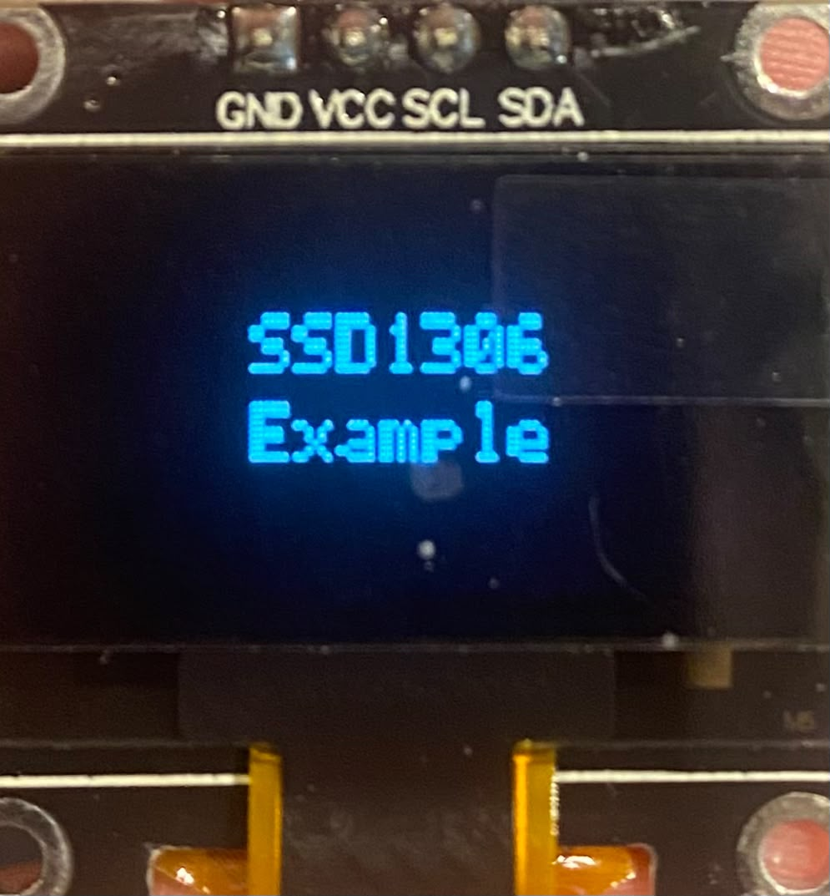

# STM32 SSD1306 OLED Display Driver

This project is an STM32 HAL firmware project for driving a 128x64 SSD1306
OLED display with a NUCLEO-L476RG board over I2C.

The SSD1306 display driver and bitmap font support are written for this
project. The firmware initializes the OLED, writes text into a local
framebuffer, and sends the framebuffer to the display.

## Features

- STM32L476RG / NUCLEO-L476RG based project
- SSD1306 128x64 monochrome OLED support
- I2C communication with the OLED display
- 1024-byte framebuffer for the full screen
- Pixel drawing support
- Bitmap font rendering support
- Text rendering with multiple font sizes
- Simple example text displayed on the OLED

## Hardware

- NUCLEO-L476RG development board
- SSD1306 128x64 OLED display module
- USB cable for board power and programming
- Jumper wires

## Default Configuration

| Item | Value |
| --- | --- |
| MCU | STM32L476RG |
| Board | NUCLEO-L476RG |
| Display | SSD1306 OLED |
| Resolution | 128x64 |
| Interface | I2C |
| I2C peripheral | I2C1 |
| OLED I2C address | `0x3C` |
| Framebuffer size | 1024 bytes |

## Wiring

Typical wiring for an I2C SSD1306 OLED module:

| OLED Pin | NUCLEO-L476RG |
| --- | --- |
| VCC | 3.3 V |
| GND | GND |
| SCL | I2C1 SCL |
| SDA | I2C1 SDA |

Make sure the OLED module and STM32 board share a common ground. Some OLED
modules support 5 V power, but 3.3 V is usually the safest choice with STM32
logic levels.

## Project Structure

```text
Core/
  Inc/
    ssd1306.h                     SSD1306 driver interface
    fonts.h                       Bitmap font interface
    main.h                        Main application declarations
    i2c.h                         STM32 I2C declarations
    gpio.h                        STM32 GPIO declarations
  Src/
    main.c                        Main application and OLED example
    ssd1306.c                     SSD1306 driver implementation
    fonts.c                       Bitmap font data and glyph lookup
    i2c.c                         I2C initialization
    gpio.c                        GPIO initialization
Drivers/                          STM32 HAL and CMSIS drivers
    L476RG_SSD1306_128X64.ioc     STM32CubeMX project configuration
```

## How It Works

1. `main.c` initializes HAL, the system clock, GPIO, and I2C.
2. `SSD1306_Init(&hi2c1)` configures the OLED controller.
3. `SSD1306_Clear()` clears the local framebuffer.
4. `SSD1306_WriteString()` draws text into the framebuffer using bitmap fonts.
5. `SSD1306_UpdateScreen()` sends the framebuffer to the OLED over I2C.

The display is not written pixel-by-pixel directly during drawing. Drawing
functions update the local framebuffer first, then the full framebuffer is sent
to the display.

## Current OLED Example

The current example in `main.c` writes:

<p align="left">
  
</p>


using `Font_7x10`.

## Available Font Sizes

| Font | Use case |
| --- | --- |
| `Font_6x8` | Small text and dense information |
| `Font_6x10` | Small text with more height |
| `Font_7x10` | General readable text |
| `Font_8x13` | Labels and status text |
| `Font_11x18` | Larger values or headings |
| `Font_16x26` | Big numbers or short display values |

## Important Files

- `Core/Src/ssd1306.c`: SSD1306 initialization, framebuffer handling, pixel
  drawing, character drawing, and string drawing.
- `Core/Inc/ssd1306.h`: public SSD1306 driver functions and display constants.
- `Core/Src/fonts.c`: bitmap font tables and glyph lookup.
- `Core/Inc/fonts.h`: font structure, public font definitions, and glyph API.
- `Core/Src/main.c`: example OLED initialization and text output.

## Notes

- The OLED framebuffer size is `128 * 64 / 8 = 1024` bytes.
- The driver currently uses SSD1306 I2C address `0x3C`.
- Characters outside printable ASCII range are rendered as `?`.
- Text drawing stops when the next character would pass the right edge of the
  display.
